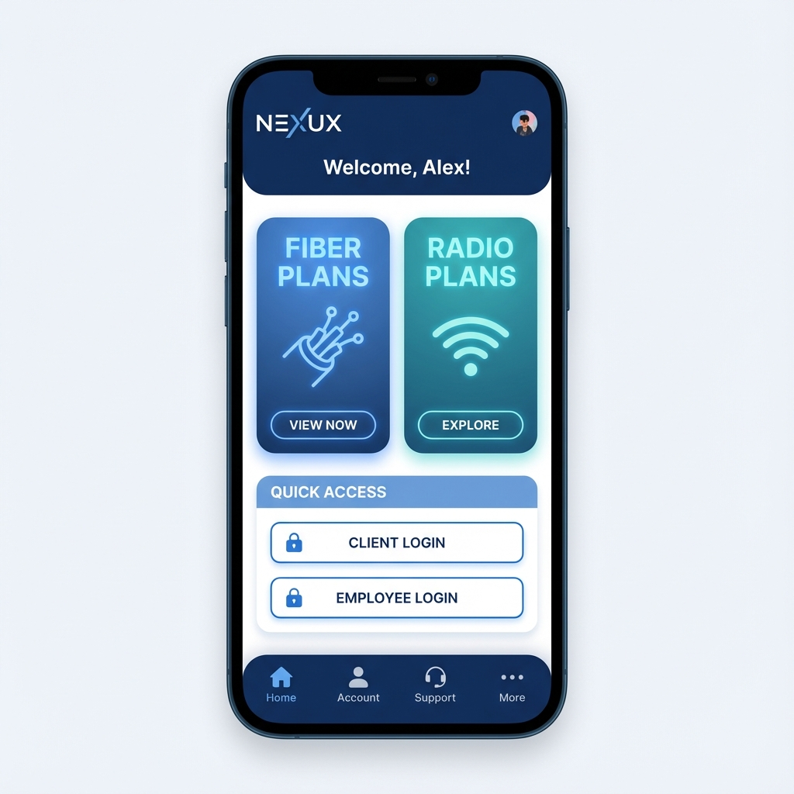

# NEXUX - Sistema e App de Gestão de Internet

Bem-vindo ao repositório oficial da **NEXUX**, uma solução completa para provedores de internet (ISP) que integra um **Aplicativo Móvel** (Android/iOS) e uma **Plataforma Web** moderna.

Este projeto visa facilitar a vida dos clientes e colaboradores, oferecendo desde contratação de planos até gestão administrativa na palma da mão.

---

## 📱 Funcionalidades do Aplicativo (Mobile)

O aplicativo foi desenvolvido com **React Native** e oferece uma experiência nativa e fluida.

### Para Clientes

- **Vitrine de Planos:** Visualização detalhada de planos de Fibra Óptica e Internet Rádio.
- **Área do Cliente:** Login seguro para acessar faturas, contratos e dados pessoais.
- **Cadastro Simplificado:** Novos clientes podem se cadastrar diretamente pelo app.
- **Edição de Perfil:** Atualização de dados cadastrais em tempo real.

### Para Colaboradores

- **Login Administrativo:** Acesso exclusivo para funcionários.
- **Gestão de Clientes:** Visualização e administração da base de usuários.
- **Painel de Controle:** Ferramentas para dia a dia operacional.

---

## 🌐 Funcionalidade Web (Desktop)

A versão Web foi construída com foco em **experiência do usuário (UX)** e **design premium**, utilizando todo o poder do _React Native for Web_.

- **Landing Page Exclusiva:** Ao acessar pelo computador, o usuário é recebido por uma interface rica, com menus de navegação, banners promocionais e apresentação de planos em grade.
- **Design Responsivo:** O layout se adapta automaticamente a telas grandes (Desktop) e pequenas (Tablets/Celulares).
- **Acesso Unificado:** O mesmo sistema de login e funcionalidades do app está disponível no navegador.

---

## 🚀 Como Executar o Projeto

Este projeto utiliza o **Expo SDK 54**.

### Pré-requisitos

- Node.js instalado.
- Gerenciador de pacotes `npm`.

### Passo a Passo

1.  **Instale as dependências:**

    ```bash
    npm install
    ```

2.  **Para rodar no Celular (Expo Go):**

    ```bash
    npx expo start
    ```

    - Escaneie o QR Code com o app Expo Go (Android) ou Câmera (iOS).

3.  **Para rodar na Web:**
    ```bash
    npx expo start --web
    ```
    - O navegador será aberto automaticamente.

---

## 🛠️ Tecnologias Utilizadas

- **React Native:** Framework principal.
- **Expo:** Plataforma de desenvolvimento e build.
- **React Navigation:** Roteamento e navegação de telas.
- **React Native Web:** Adaptação do código nativo para navegadores.

---

## 📸 Telas do Sistema (Mockups)

### Aplicativo Mobile



### Versão Web


---

© 2024 NEXUX Internet. Todos os direitos reservados.
